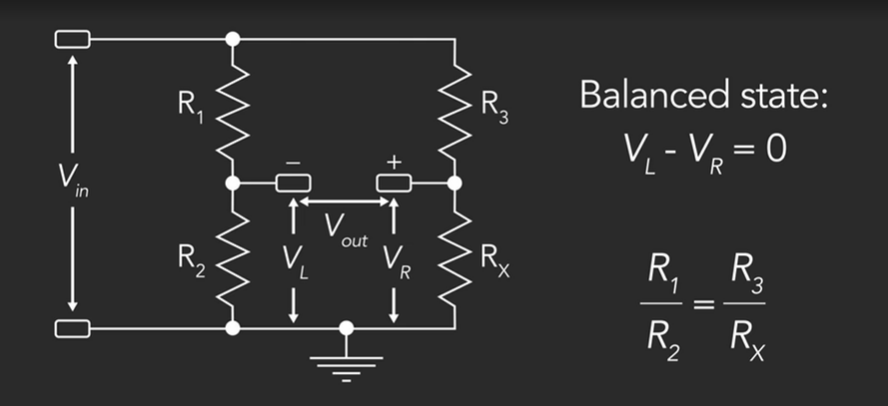



## Kirchhoff's Current Law

Current entering the node = Current exiting the node

## Kirchhoff's Voltage Law

Directed sum of voltages around a loop = 0

## Wheatstone Bridge

* Differential measurement;
* Sensitive.