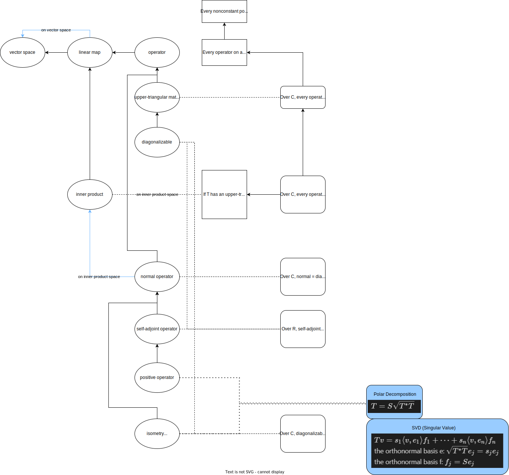



|linear map|
-----
$T(u+v) = Tu + Tv$   $T(\lambda v) = \lambda T(v)$
(Fundermental Theorem) $u_1,\dots,u_m, v_1,\dots v_n$, u is a basis of null $T$, then $Tv_1,\dots,Tv_n$ is a basis of range $T$.

|upper-triangular matrix|
------
$T$ with respect to $v_1,\dots,v_n$ is upper triangular.
$Tv_j\in span(v_1,\dots v_j)$ for each $j=1,\dots,n$.
$span(v1,\dots,v_j)$ is invariant under $T$ for each $j=1,\dots,n$.

|diagonalizable|
------
$V$ has a basis consisting of eigenvectors of $T$.
There exists 1-dimensional subspaces $U_1,\dots,U_n$ of $V$, each invariant under $T$, such that $V=U_1\oplus\dots\oplus U_n$.
$V=E(\lambda_1,T)\oplus\dots\oplus E(\lambda_n,T)$.
$dimV$ = $dimE(\lambda_1,T)+\dots + dimE(\lambda_m,T)$

|normal operator|
------
$TT^*=T^*T$
$\lVert Tv \rVert = \lVert T^*v \rVert$
(property) $Tv=\lambda v \iff T^*v=\overline{\lambda}v$
(property) Eigenvectors corresponding to distinct enginvalues are orthogonal.
Over $C$, normal = diagonalizable with respect to an orthogonal basis

|self-adjoint operator|
------
$T = T^*$
$\langle Tv,w\rangle=\langle v,Tw\rangle$
$M(T)=M(T^*)$ with respect to orthonormal bases.
Over $C$, $\langle Tv,v\rangle\in R$
(property) Every eigenvalue is real.
(property) Eigenvectors corresponding to distinct enginvalues are orthogonal.
(property) $\langle Tv,v\rangle=0 \rightarrow T=0$ (This is interesting only over $R$, because over $C$, it is always true, not just for self-adjoint oprators.)
Over $R$, self-adjoint $\iff$ diagonalizable with respect to an orthogonal basis

|positive operator|
-----
self-adjoint $\langle Tv,v \rangle\ge0$ for all $v\in V$
self-adjoint all the eigenvalues of $T$ are nonnegative.
$T$ has a positive square root. (and it's unique)
$T$ has a self-adjoint square root.
there exists an operator $R\in L(V)$ such that $T=R*R$.

|isometry|
-----
perserves norms: $\lVert Sv \rVert = \lVert v \rVert$ for all $v\in V$
$\langle Su,Sv \rangle = \langle u,v \rangle$ for all $u,v \in V$
$Se_1,\dots,Se_n$ is orthonormal for every orthonormal list $e_1,\dots,e_n$ in $V$.
there exists an orthonormal basis $e_1,\dots,e_n$ of $V$ such that $Se_1,\dots,Se_n$ is orthonormal.
$S^*S=I$
$SS^*=I$
$S^*$ is isometry.
$S$ is invertible and $S^{-1}=S^*$
Over C, diagonalizable with respect to an orthogonal basis (eigenvectors), and eigenvalues have absolute value 1.

$T=S\sqrt{T^*T}$

$Tv=s_1 \langle v,e_1 \rangle f_1 + \dots + s_n \langle v,e_n \rangle f_n $  
the orthonormal basis e: $\sqrt{T^*T}e_j = s_j e_j$  
the orthonormal basis f: $f_j=Se_j$