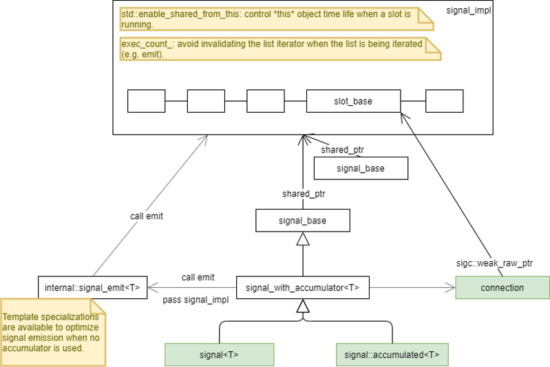
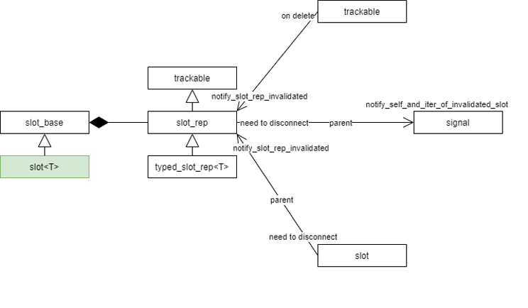
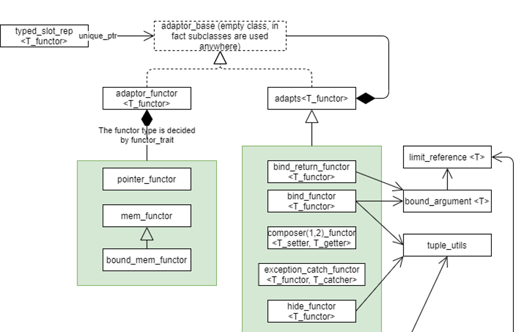

* 一个signal实际上就是一组slot（然后每个slot中最终是一个functor），但是slot是通过template实现的，类型并不相同，如何一起存储在container中？
   * slot类模板从同一个基类slot_base继承而来。slot类模板只处理类型相关的事情。
   * signal看到的是slot_base；这样就能保存在同一个container中了。
   * slot模板类自己知道类型信息，所以通过slot_base中保存的raw pointer，cast成正确的类型就可以call了。

* signal看到的是slot_base，但是slot_base并没有类型信息，如何call它呢？
   * signal模板类也是有类型信息的，它也是通过slot_base中保存的raw pointer，cast成正确的类型就可以了。
   * 所以signal和slot的类型信息是一样的。

* 能从signal拿到所有的slot包括其类型吗？
   * signal模板类（准确说是signal_with_accumulator）是有类型信息的，所以能够把slot_base转成包含类型信息的的slot模板类。



* slot存的是一个void*吗？存的是functor？
   * slot先有一个成员是slot_rep，它负责clone，各种notification。
   * slot_rep中有一个的call_成员是`void* (*)(void*)`类型。
   * slot_rep的子类typed_slot_rep中会保存一个functor。
   * 把二者联系起来的是internal::slot_call类模板。
      * 通过每一种functor作为模板参数特化的模板类slot_call都有一个静态函数call_it。slot_rep中的call_指向的是这个静态函数。
      * 这个call_it的调用需要传入slot_rep，它会被cast成typed_slot_rep，进而拿到其中functor成员，call这个functor。

* 能从slot拿到adaptor包括其类型吗？
   * 不能从slot模板类推导出adaptor的类型。
      * 因为slot的类型和functor的类型不一定相同，只要call的时候能隐式转换就行。
   * 从slot_rep也不能拿到adaptor的类型。
      * call_是个void指针，没有任何类型信息。
      * call_被调用的时候，使用的是slot的类型信息对其cast成函数指针。
      * call_指向的call_it函数，是通过类模板特化而来的，它是知道functor的类型的，可以把slot_rep转成typed_slot_rep。即这个functor的类型信息被隐藏在这个模板类函数中。
   * 总结：slot只知道一个函数指针，知道怎么call这个函数，但这个函数的内部实现它是不知道的。
   * slot_rep的功能决定了它是一个虚类，通过RTTI我们能够知道一些类型信息。（帮助有限）



* slot中的各种adaptor/functor是怎样的继承类型？
   * 从slot的角度来看，并不需要有什么继承关系。因为只要能满足call_it中对它调用operator()就行。
   * 但是slot中所有的functor都是一个adaptor_base，即都是从它继承而来的，原因见下一条。

* 如何区分处理传给slot的functor是raw functor pointer，以及已经被sigc包装过的一个adaptor？
   * sigc所有的functor都是从adaptor_base基类继承的。
   * 如果传入的已经是一个从adaptor_base继承而来的adapt，直接就用传入的这个adapt。
   * 如果传入一个非sigc adaptor的functor（比如raw functor pointer，lambda，std::function，自定义等），会把它用adaptor_base的子类adaptor_functor包一下。

* adapts是如何设计的？为何需要一个基类？
   * adapts是对现有的adaptor（包括adatpor_functor和adapts），再包装一下（bind，compose，hide）。
   * 如果传入的functor不是adaptor，需要先转换成adatpor_functor。这个基类就是用来保证这一点的。所以传入的任何functor最终都会成为一个adaptor。

* 当一个adapts中的sigc functor（也就是adaptor_base）成为invalidate？如何保证这个adapts也能够被invalidated？
   * 每一个adapt都应该提供一个`sigc::visitor<my_ns::my_adaptor<T_functor>>::do_visit_each<>()`的函数。函数实现中要写清楚，这个adapt关联于哪些对象。比如trackable objects；比如sigc functors，因为sigc functor中很可能会（直接或通过递归间接）包含trackable objects。

* slot是一个functor吗？
   * slot当然是一个functor，它会被adaptor_functor直接包装一下；任何形式的functor（lambda，std::function，自定义）都会被adaptor_functor简单包一下。需要额外处理的时pointer functor，mem functor，bound mem functor这些raw pointer，sigc会先用自定义的functor包装一下，再放到adaptor_functor中。

* 如何判定是raw pointer（ptr fun，mem fun）。
   ```
   template<typename T_return, typename... T_arg>
   struct functor_trait<T_return (*)(T_arg...)>

   template<typename T_return, typename T_obj, typename... T_arg>
   struct functor_trait<T_return (T_obj::*)(T_arg...)>   
   
   template<typename T_return, typename T_obj, typename... T_arg>
   struct functor_trait<T_return (T_obj::*)(T_arg...) const>

   ```

* std::function和lambda这种functor是如何处理的？如何能被正确处理invalidate？
   * 和slot类似，会被视为一个普通的functor。
   * 这类functor的invalidate，需要手动处理。构造一个track_object（是个adapt类），构造的时候需要表达这个functor关联到了哪些sigc::trackable对象.

* signal的connect方法，一般给的是一个functor，而不是一个slot；怎么样区分出来传过来的是slot还是functor，以及如果是functor的话如何从functor创建出对应的slot？
   * connect方法只接受slot；而slot的构造函数接受任何functor，且此构造函数不是explicit的。传入的functor会被sigc adaptor包一下，放到typed_slot_rep中。

* 能从adaptor拿到原始的传入的functor吗？
   * 首先注意从slot是不能拿到typed_slot_rep的。这里假设已经想办法得到typed_slot_rep了。typed_slot_rep是用functor类型特化的模板类。
   * 如果内部adaptor_type是一个adaptor_functor，他们内部保存了原始的functor（以原始类型）。
   * 如果内部adaptor_type是一个adapts，它内部的functor可能是一个adapts或者adaptor_functor，需要递归展开得到最终的adaptor_functor。
   * 这里不需要任何类型cast，因为都是具体类型。

* 最后的总结。
   * 抛开所有的细节不考虑，实际上就是要把不同类型的functors，挂到同一个signal上。无论怎样封装和组织，都必须要有一个环节，把不同类型的functors统一。统一就是提取概念进行抽象，这个抽象过程就把functor的具体信息给隐藏了。
   * slot比slot_base多出来的就是让它成为了一个functor（这也是为什么代码文件组织上它是在functor文件夹下），以及为了实现这个目的需要的模板参数（即类型信息）。

* std::function的实现：
   * std::function这个模板类是从_Func_class继承而来的。_Func_class也是一个模板类，是由函数签名特化而来的。(对应于slot类)
   * _Func_class有一个_Ptrt类型的指针。_Ptrt是一个虚基类_Func_base。（对应于slot_rep类）
   * 根据不同类型的functor/callable，会通过模板特化得到_Ptrt的子类_Func_impl_no_alloc，子类负责_Do_call的实现。子类是保存了functor/callable对象的。（对应于typed_slot_rep类）
