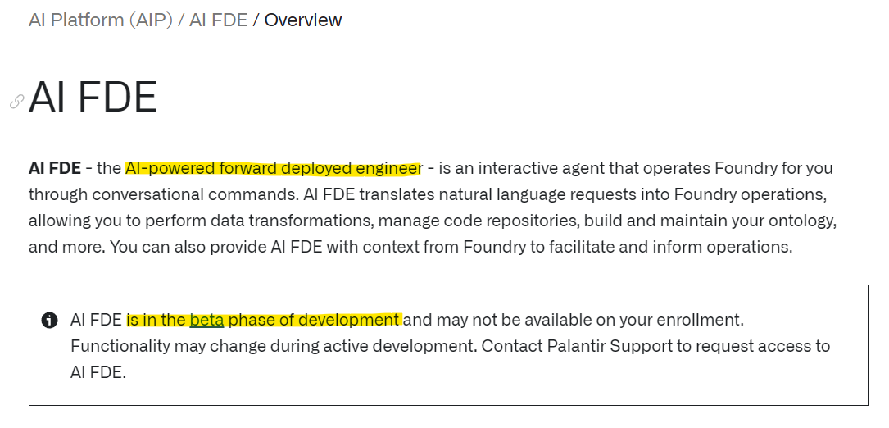
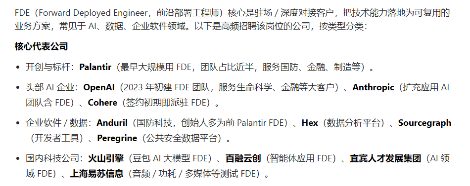

# Palantir FDE

* 业务特色需要这种角色：
  * 科技型战略咨询 rather than SaaS
  * 高度定制化的软件
  * 工程师驻场

从 Foundry demo 可以看出来需要技术和业务的深度配合

* 团队构成与分工
  * Echo 团队：嵌入式分析师 + 客户经理，懂行业，挖掘痛点、管理关系。
  * Delta 团队：快速原型工程师，把需求转为可运行代码与方案，快速交付与迭代。

* 工作流程（3-6 周闭环）
  * 战略聚焦：锁定高价值业务假设。
  * 本体共建：与客户共建本体模型，统一业务语义。
  * 敏捷融合：用 Foundry/Apollo 快速对接数据，做交互式原型。
  * 动作封装：把决策点 / 人工操作封装为可复用 “动作”。
  * 成果交付：演示并全组织部署，沉淀经验回传总部。

Palantir FDE（FDSE）招聘要求  

* 基础门槛：计算机 / 数学 / 工程等相关本科及以上；Python/Java/C++/TypeScript/SQL 等至少一门语言熟练；熟悉数据结构、存储与云基础架构。

* 核心技术：Foundry/Gotham 平台实操（Ontology、Pipeline Builder、Code Workbook 等）；Spark/ETL 数据流水线；全栈开发（React/TypeScript + 后端）；云（AWS/Azure/GCP）与容器化（Docker/K8s）经验加分。

* 客户能力：客户现场交付经验；跨技术 / 非技术团队协作；复杂业务需求拆解与方案落地；快速迭代与问题解决，接受 25%-50% 出差。

  

 

就连这样的工作内容也在尝试用 AI 替代：

https://www.palantir.com/docs/foundry/ai-fde/overview

# 其它公司的 FDE

OpenAI FDE 招聘要求

* 基础门槛：软件 / ML / 技术部署 **5 年 +** 经验（新岗可能放宽）；本科及以上，垂直领域（如生命科学）优先硕博；Python/JavaScript/TypeScript 等编码能力扎实。

* 核心技术：LLM / 生成式 AI 端到端部署（从原型到生产）；云（AWS/GCP/Azure）架构与网络；全栈开发（React/Next.js+Python/Node.js）；数据系统（Postgres/MySQL）与 CI/CD 经验。

* 客户与行业：客户现场需求挖掘与方案落地；金融 / 生命科学 / 企业 IT 等行业经验优先；评估设计、错误分析与合规验证能力；跨层级沟通，将技术权衡转化为业务价值。

 

https://www.bilibili.com/video/BV1jwBABAEfe/

Paypal/Palantir/OpenAI 的观点：

AI Agent 领域还没有成熟稳定的产品，需要大量的 product discovery 工作要做，所以 FDE 模式开始兴起。

The FDE model，is doing things that don't scale at scale.（规模化地去做那些难以规模化的事情）。

