# foundry - demo

https://www.bilibili.com/video/BV1uDqVBjED8/?spm_id_from=333.337.search-card.all.click

**企业操作系统**

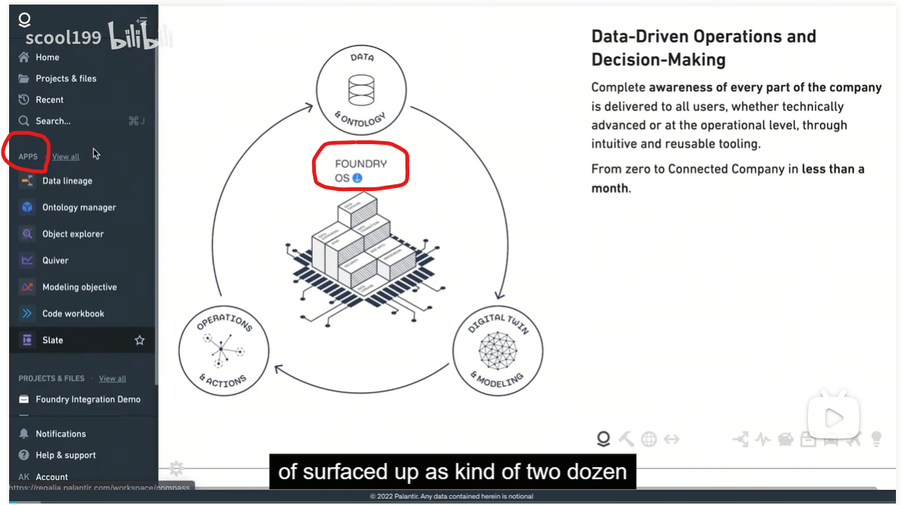

---

**数据连接器（connectors）** 

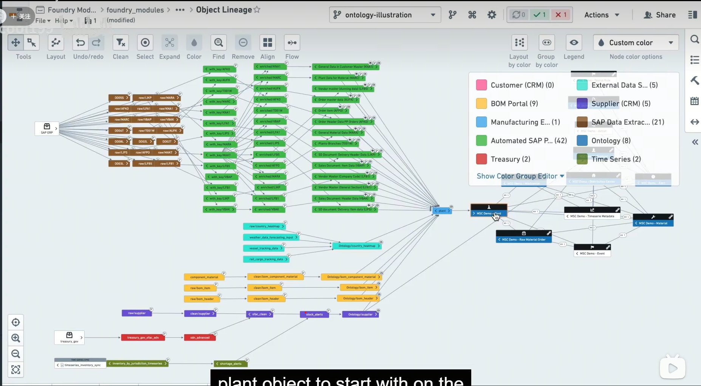

每个节点对数据进行 refining，cleaning，joining，applying business logic

**Data Versioning**

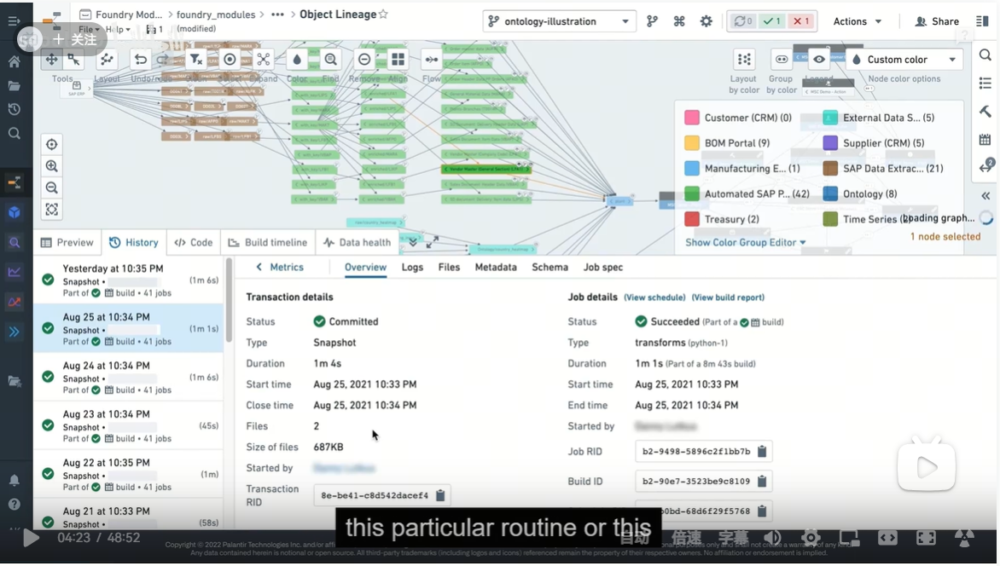

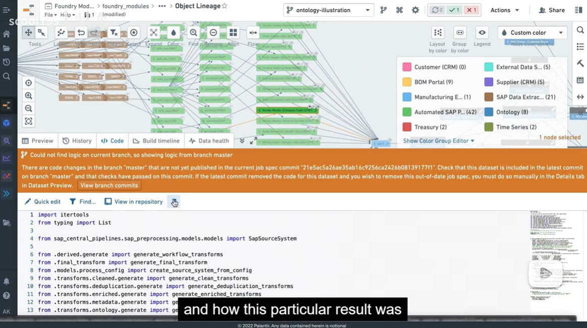

**Software-defined data integration**

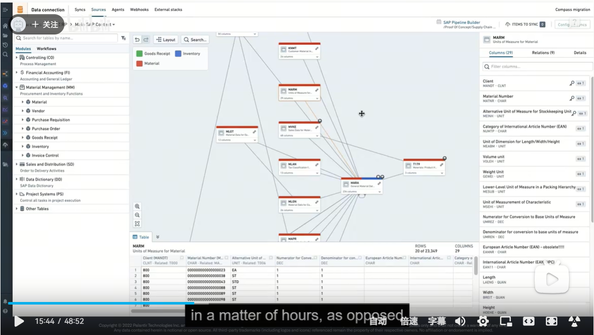

比如对于 SAP 数据，通过其 NetWeaver 应用层，可以自动生成 pipeline，甚至 objects，在**数小时之内**。手动的话需要几个礼拜甚至几个月。

之前截图中的绿色节点就是这样生成的。

---

Data Integration 之后，业务/管理人员需要参与进来，和 IT 人员一起定义 Objects (包括 Links)

**Object**

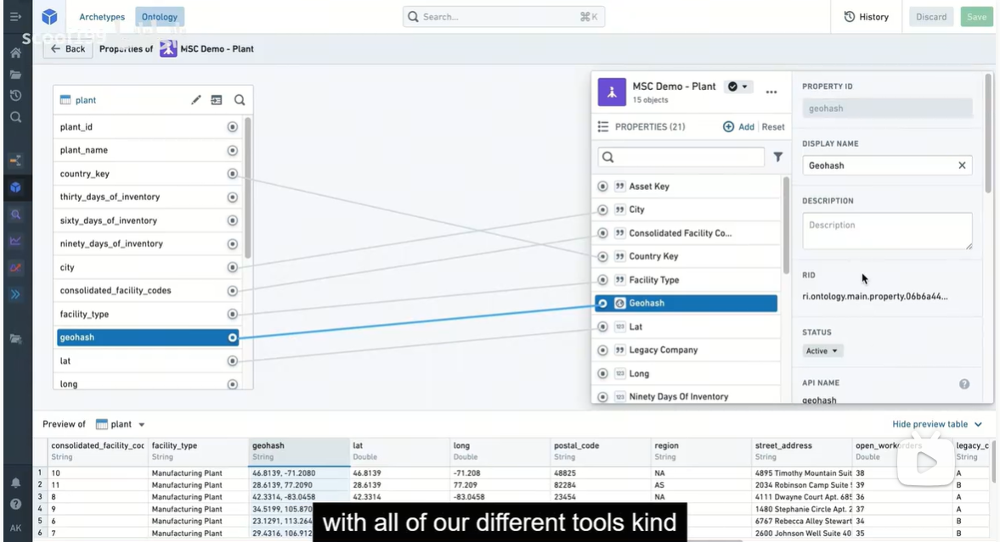

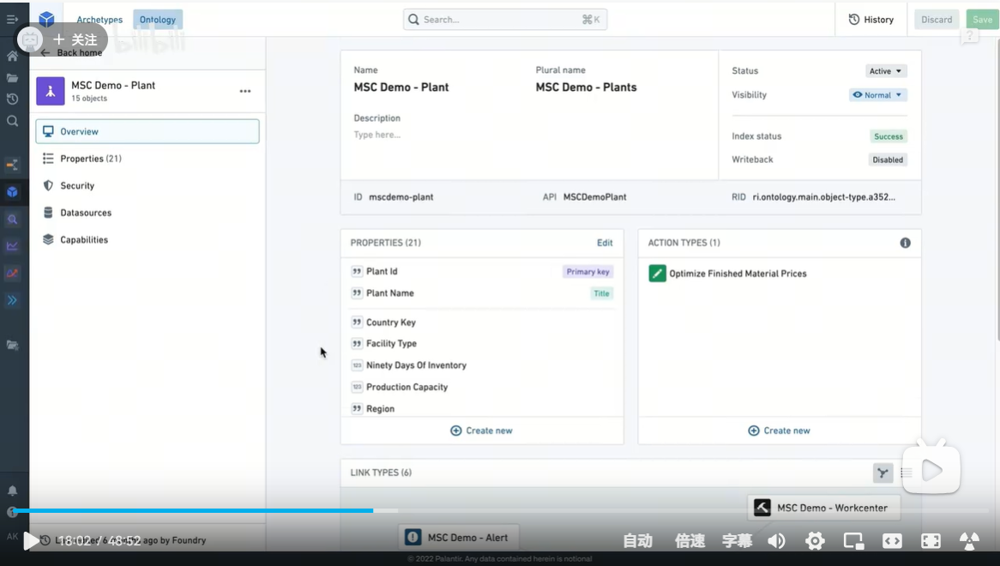

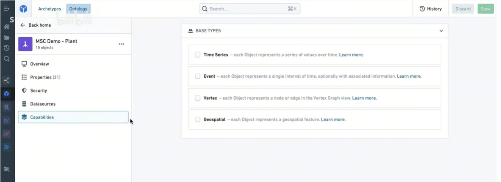

**Object Exploration**

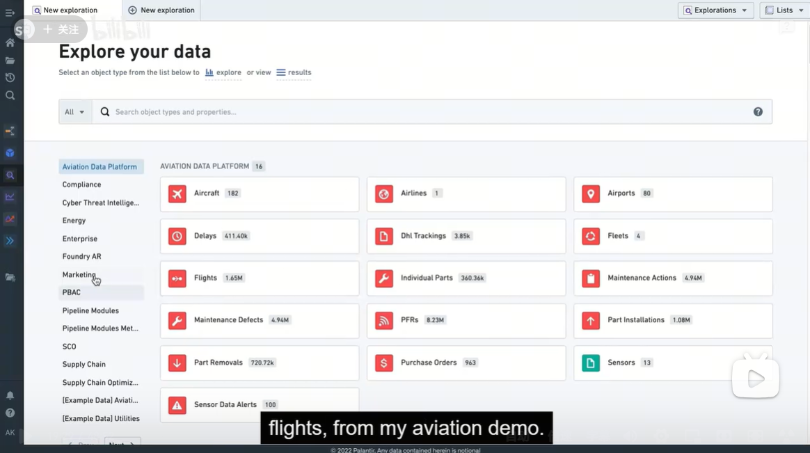

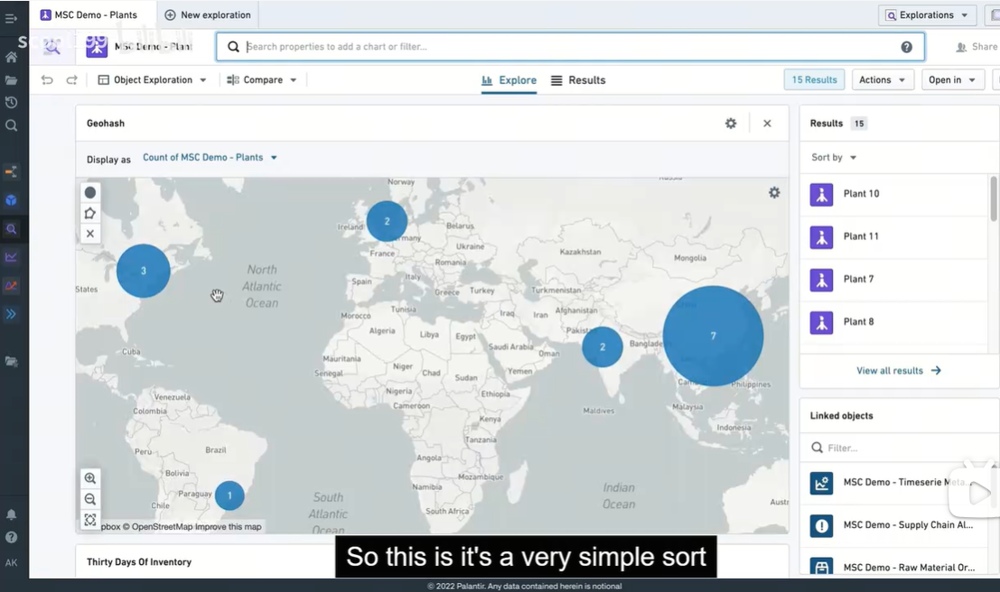

基于定义好的 Objects，可以做各种图表，timeline，map view 等展现形式。略...

---

**Modeling**

使用内置的 data science tool 来创建一个模型：

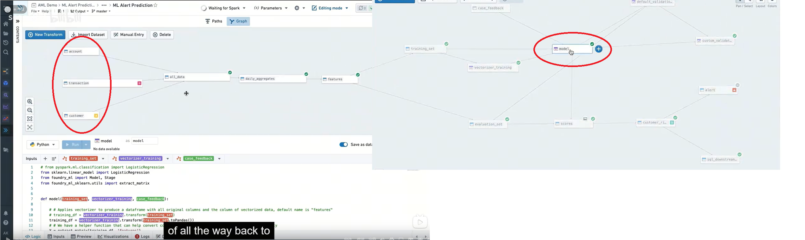

**Model Library**

Objective

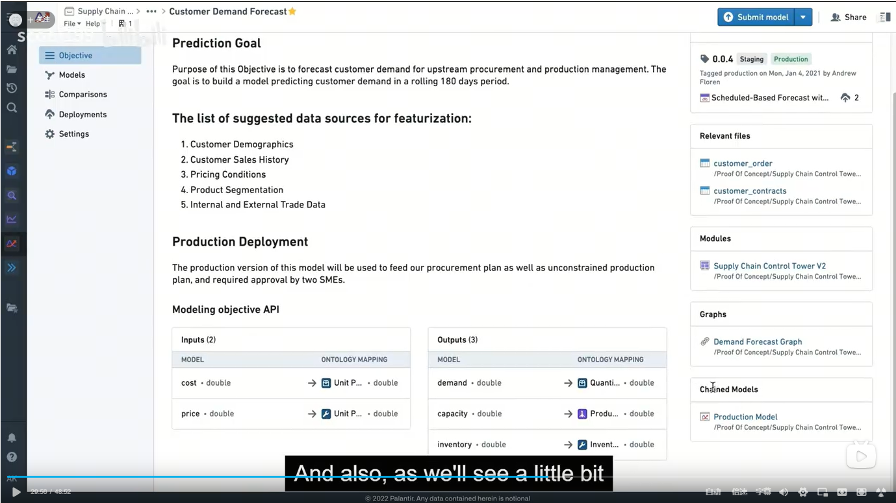

Model Comparisons

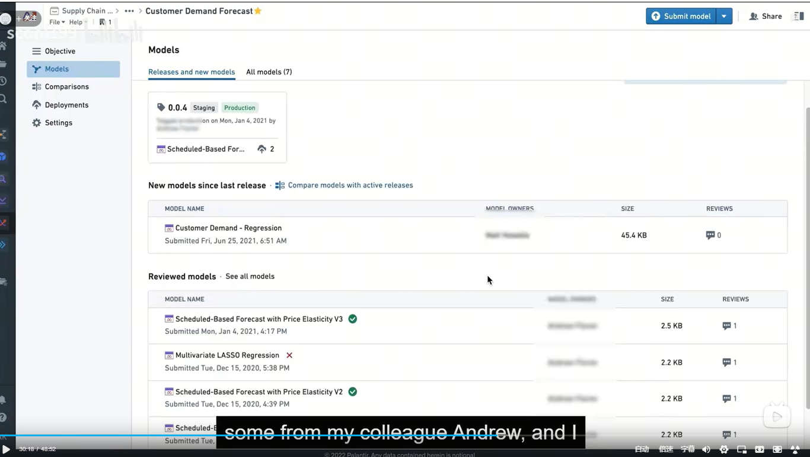

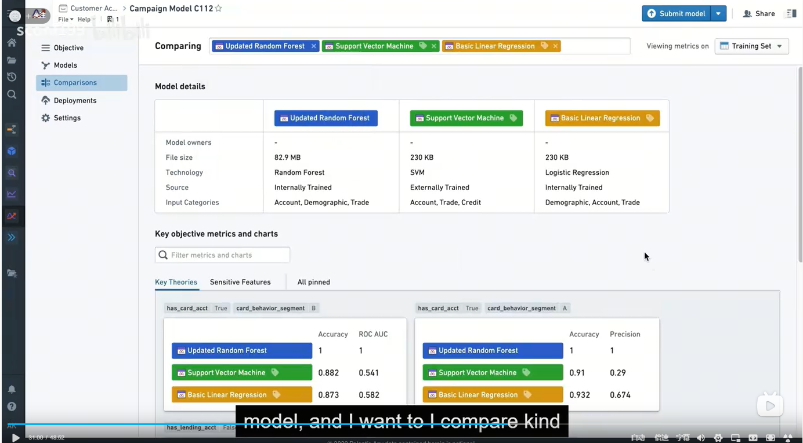

**将 Model 加入到本体中**

输入来自于 Objects；将输出传给 Objects

---

**Operation**

例子：一个 Application，其包含的一个 model pipeline，产生了一个 Alert

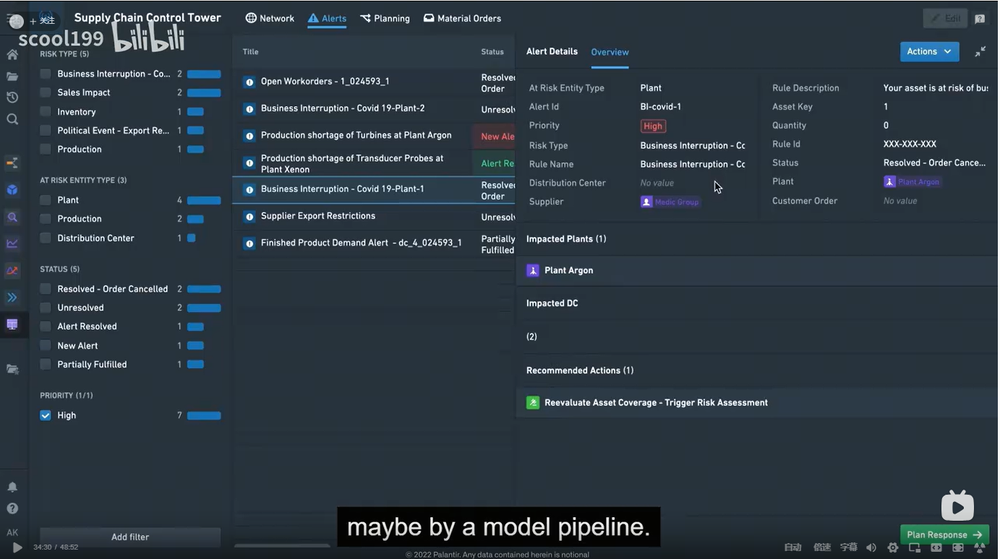

此时需要 take actions，比如 取消关联的订单

**Action**

因为 Objects 之间复杂的关联关系，Action 必须属于 Core Level 中处理，和 Objects，Relations 是同一个级别

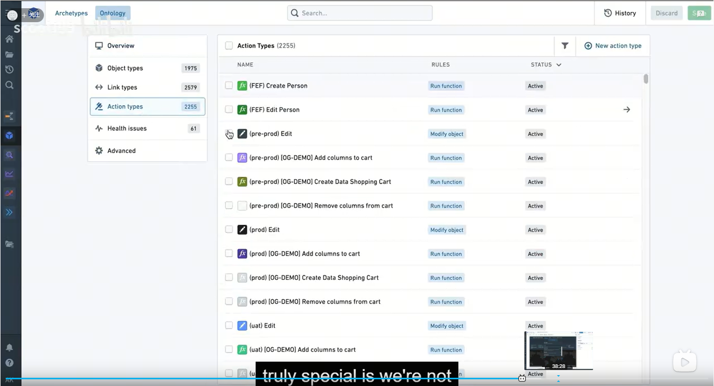

Action 可以更新 Objects

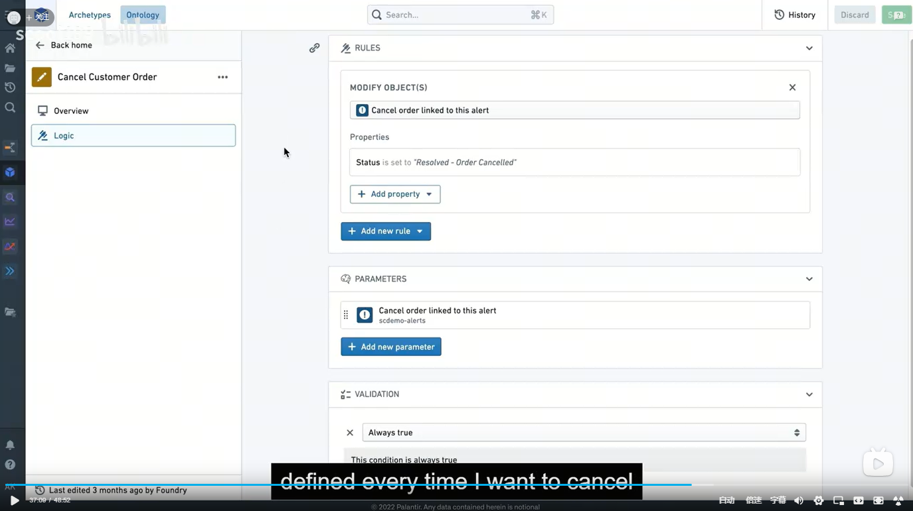

可以把数据同步回到 ERP 系统中

---

**Digital Twin**

Data-Driven Operations and Decision-Making

Birds eye view of the entire value chain

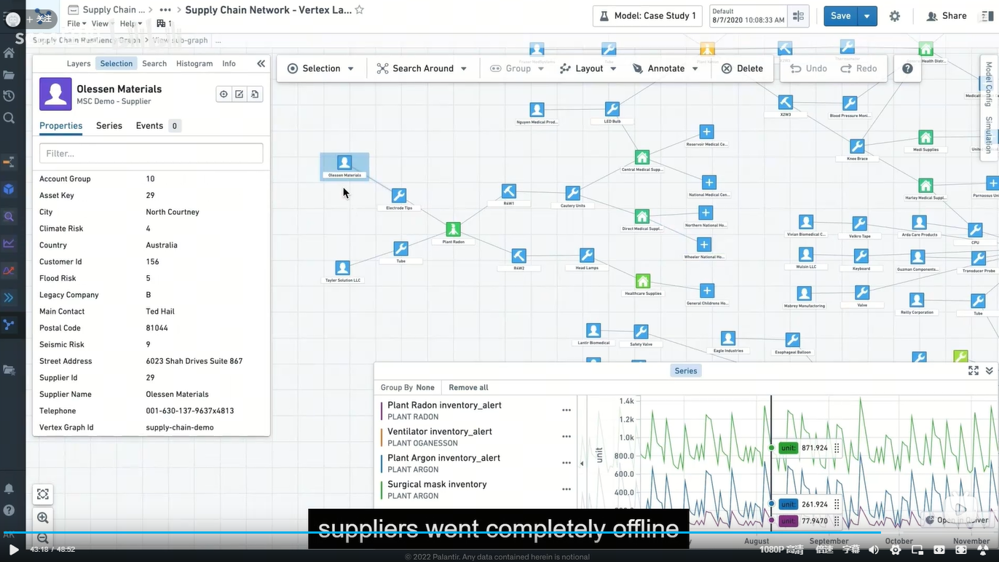

**Simulation**

在此图中，比如左边的供应商如果停止供货，比如右边的顾客需求暴增，我们如何调整整个系统？

The sandbox verion of your world，应该把 Models 放到一起来看。

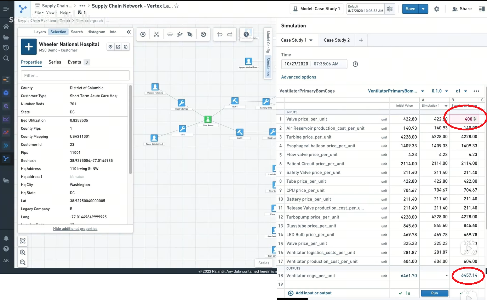

