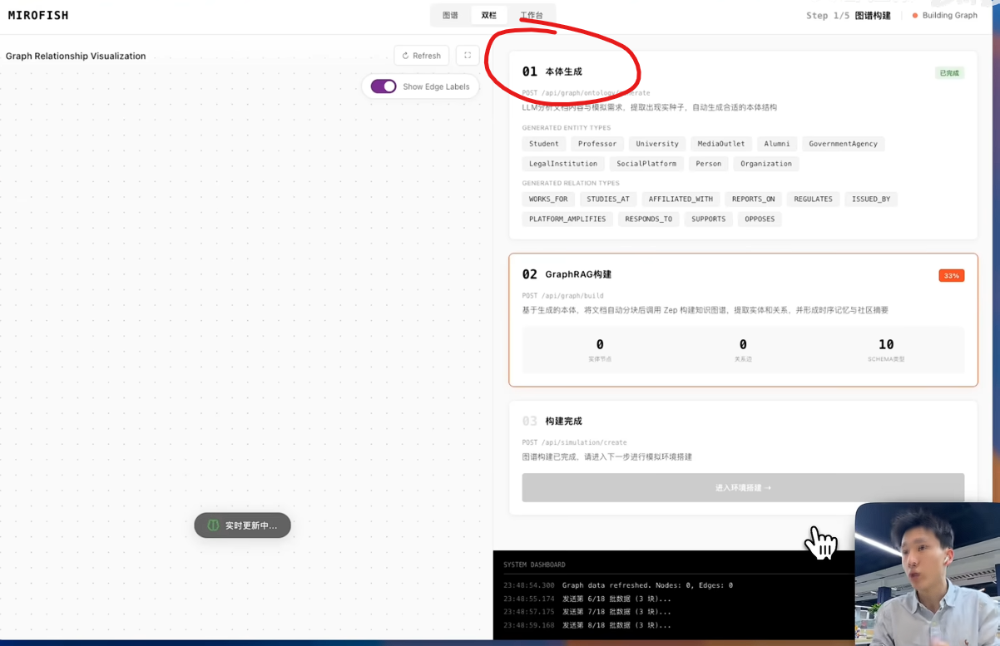
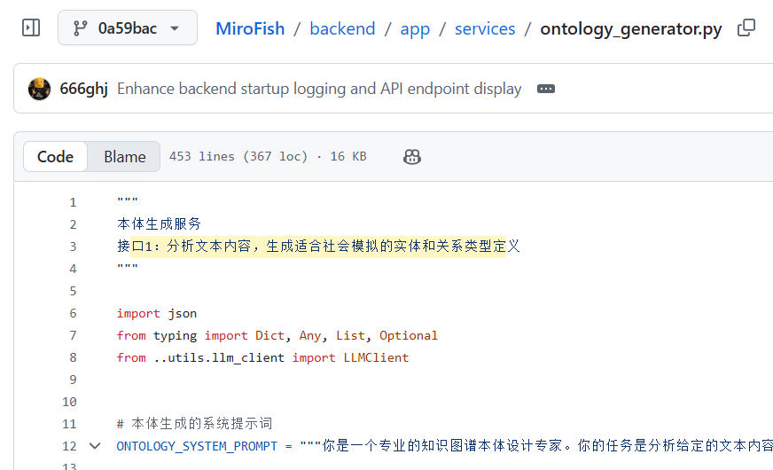
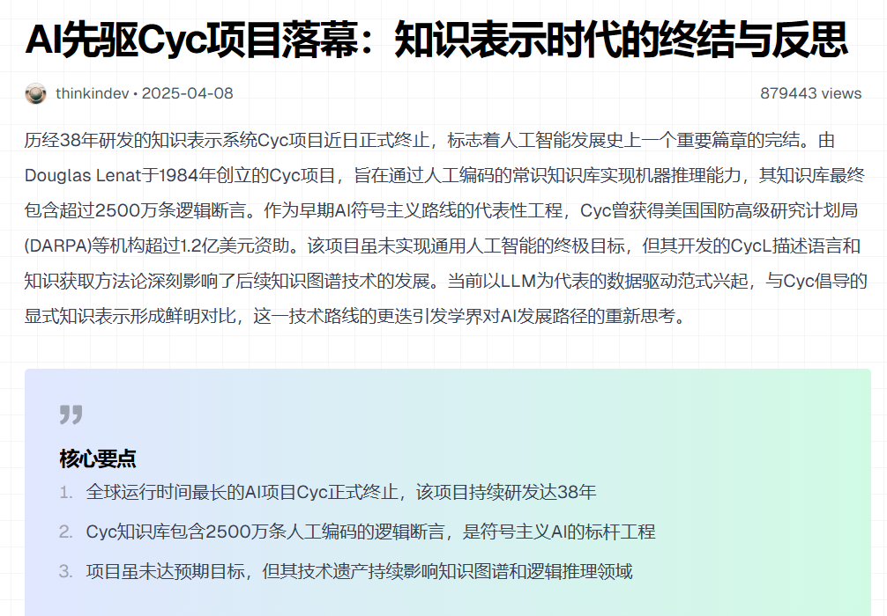

# 本体

## MiroFish

https://github.com/666ghj/MiroFish

[MiroFish 理解的本体](https://github.com/666ghj/MiroFish/blob/0a59bace92893462ae366eb6844ef126d30f863d/backend/app/services/ontology_generator.py#L156)

## Cyc

https://zh.wikipedia.org/wiki/Cyc
https://en.wikipedia.org/wiki/Ontology_(information_science)

Cyc是一个致力于将各个领域的本体及常识知识综合地集成在一起，并在此基础上实现知识推理的人工智能项目。其目标是使人工智能的应用能够以类似人类推理的方式工作。这个项目是由道格拉斯·莱纳特在1984年设立的。

https://yuxi.ml/cyc/?utm_source=uwl.me

## 本体论和知识图谱 （Copilot 的解释）

* 本体论是知识图谱的基础：本体论定义了领域中的概念、属性和关系规则，相当于知识图谱的“schema（模式）”。
* 知识图谱依赖本体论来组织数据：知识图谱中的实体和关系需要遵循本体论的定义，才能保证语义一致性和可推理性。
* 两者共同服务于知识表示与推理：本体论提供逻辑框架，知识图谱提供数据实例，两者结合能支持语义搜索、智能问答、推荐系统等应用。

| 维度 | 本体论（Ontology） | 知识图谱（Knowledge Graph） |
|------|------------------|---------------------------|
| **定义** | 一种形式化的语义模型，描述领域中的概念、属性、关系及约束规则 | 基于图结构的知识库，由实体（节点）、关系（边）、属性组成 |
| **抽象层次** | 高度抽象，偏向理论和逻辑框架 | 具体实例化，偏向数据和应用 |
| **内容** | 定义“类”和“关系”，不包含具体个体 | 包含具体实体及其关系，例如“张三属于销售部” |
| **作用** | 提供统一的语义标准，支持推理 | 提供可查询、可计算的知识网络 |
| **类比** | 相当于数据库的“表结构” | 相当于数据库中的“数据记录” |

